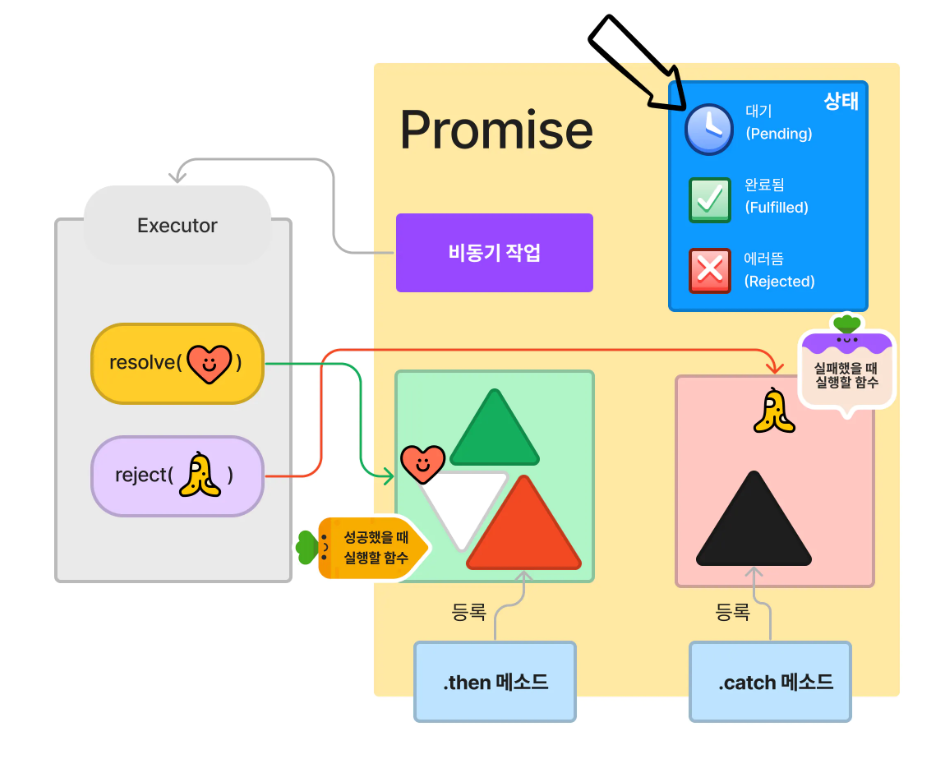

# 🥑 DTO & JSON & CORS

DTO (DATA TRANSFER OBJECT) : 데이터 전송 객체. between processes! 계층 간 데이터 교환을 위해 사용하는 객체이다. DTO를 사용하면 도메인을 캡슐화하고 UI화면에서 사용하는 데이터만 선택적으로 보낼 수 있다. DTO는 클라이언트 요청에 포함된 데이터를 담아 서버에 전달하고, 서버의 응답 데이터를 담아 클라이언트에 전달하는 계층간 전달자 역할을 한다.

DTO와 VO의 차이&#x20;

:thumbsup: D_TO와 VO는 무기력한 도메인 모델인가..에 대한 나의 답은 세모다._  DTO건 VO건 GETTER SETTER 이외에 별다른 행위가 없이 단순히 값을 전달하는 역할만 한다면 그것은 무기력한 도메인 모델이다. DTO같은경우는  GETTER와 SETTER 이외에 다른메소드가  필요하지 않으므로 무기력한 도메인모델이 될 가능성이 농후하다.  하지만 VO는 다른 로직을 포함할 수 있기 때문에  명확한 식별자나  비즈니스적으로 유의미한 내용을 갖고 있다면 그것은 더 이상 무기력하지 않은 도메인 모델이 되는 것 같다.

무기력한 도메인 모델 : 객체에  GETTER SETTER 이외에 별다른 행위가 없는 것.. 대표적인 안티패턴으로 알려져 있다. (\*안티패턴 : 비효율적이거나 생산성이 저해되는, 다시 말해서 권장사항의 반대편에 있는 소프트웨어 설계 관행을 의미한다. ) 비즈니스적으로 유의미한 행동 즉, 비즈니스 로직은 정말 하나도 없는 게터 세터만 있는 단순 DTO 느낌.. 왜 안티패턴이냐, 객체지향과 정 반대이기 때문이다. 일반적으로 객체는 속성과 기능을 가져야한다. 이러한 구현이 객체지향스러운 개발이지만 무기력한 도메인 모델은 행위가 없이 단순 속성만 갖고 있기 때문에 정 반대라고 할 수 있다. 단순 속성만 갖고 있기에 해당 객체와 관련된 비즈니스 로직을 파악하기 위해서는 전체 서비스 레이어를 살펴보아야 하고, 그렇게 되면 상당히 비효율적이기 때문에 안티패턴으로 여겨지는 것 같다.

"개발자는 도메인보다 데이터에 초점을 맞추려는 경향이 있다." 소프트웨어 개발에 대한 대부분의 접근법이 데이터베이스에 중점을 두기 때문에 도메인 개념을 설계하지 않고, 데이터의 속성과 연결을 먼저 생각하려 한다. 이를 바탕으로 데이터 모델을 대응하는 객체로 투영하게 되는데 이로 인해 GETTER SETTER 로 가득찬 무기력한 도메인이 되어버린다. 이를 조금이나마 방지하기위해 엔터티를 구현할 때 식별자를 생성해야 하는 것 같다. 식별자를 생성하는 방법에는  1. 사용자가 식별자를 직접 제공 2. 어플리케이션이 식별자를 생성 ( UUID, GUID) 3. 영속성 메커니즘이 식별자를 생성 (데이터베이스로 시퀀스나 증가값을 호출해 사용할 수 있다. 단점은 식별자를 얻기 위해 데이터베이스까지 갔다와야한다.) 4. 바운디드 컨텍스트가 식별자를 할당한다. **컨텍스트란 어떤 것을 이해하고 해석하는 데 있어서 그것이 속한 상황이나 배경, 관련된 다른 사항이 함께 고려되어야 한다는 의미이다. 소프트웨어 개발에서 컨텍스트는 소프트웨어 시스템 일부로서 비즈니스 문제 영역을 나타내고, 각각의 기능들은 서로 다른 컨텍스트를 가지고 있다. EX) 도메인은 항공,  은행   같은 특정한 비즈니스 분야 의미. 컨텍스트는  은행 도메인의   대출신청과  같은  도메인 안에서 특정한 비즈니스 문제영역 의미.**&#x20;

바운디드 컨텍스트는 큰 시스템을 여러 개의 작은 컨텍스트로 나누어 각 컨텍스트 내에서 특정한 비즈니스 규칙과 데이터 모델이 적용되는 것을 의미한다. 각 컨텍스트는 독립적으로 설계되고 구현되며, 서로 다른 컨텍스트 간에는 인터페이스를 통해 상호작용한다.

\*영속성 컨텍스트의 내부 동작 방식

* 엔터티 등록 - 1차 캐시 뿐 아니라 쓰기 지연 SQL 저장소  라는 것도 있다. 엔터티 매니저가 PERSIST를 하면 INSERT SQL이 쓰기 지연 저장소에 쌓이게 된다. 물론 동시에 1차 캐시에도 해당 엔터티가 등록 됨. 커밋을 날려 트랜잭션을 시작하면 엔터티 매니저는 우선 영속성 컨텍스트를 플러시 한다. 플러시는 영속성 컨텍스트의 변경 내용을 데이터베이스에 동기화 하는 작업. 커밋시 플러시가 자동 호출됨. JPQL의 경우  DB에 직접 접근해야 하기 때문에 쓰기 지연  SQL 저장소의 쿼리를 비워줘야 한다. 그러므로  쿼리 실행시 플러시가 쿼리 실행 이전에 호출됨.

.png>)

* 엔터티 수정 - JPA는 엔터티를 영속성 컨텍스트에 보관할 때 최초 상태를 복사한 스냅샷을 저장하고 변경이 일어나면 스냅샷과 비교를 해서 변경을 감지한다.

 (1).png>)

자바빈즈 : 자바로 작성된 소프트웨어 컴포넌트로 데이터 표현을 목적으로 하는 자바 클래스를 의미한다. 자바 빈즈 클래스는 자바 빈즈 컨벤션을 지켜야 한다. (\*자바빈즈컨벤션 : 클래스는 인자가 없는 기본 생성자를 갖는다, 클래스의 멤버 변수(속성)는 프로퍼티 라고 하며 PRIVATE 접근 제한자를 가져야 한다, SERIALIZABLE 인터페이스를 구현하며 패키징 되어야 한다, 멤버 변수 마다 별도의 get/set 메소드 존재, get메소드는 매개변수가 존재하지 않아야 한다. set메소드는 반드시 하나 이상의 매개변수가 존재해야 한다. 생성자는 매개변수 존재x, 멤버변수의 접근제어자는 private이고 각 get/set메소드의 접근제어자는 public, 클래스의 접근제어자는 public으로 정의) 등.. 일반적인 DTO라고 생각하면 될 듯.&#x20;

JSON : 자바스크립트 객체 문법을 따르는 문자 기반의 데이터 포맷. 보안문제로 대부분 JSON.parse(역직렬화)와 JSON.stringify(직렬화)로 안전하게 사용한다. 자바스크립트 객체 리터럴 문법을 따르는 문자열이기 때문에 자바스크립트의 기본 데이터 타입인 문자열, 숫자, 배열, 불리언 등등 다른 객체를 포함할 수 있다. 자바스크립트의 오브젝트는 기본적으로 key-value쌍이다. (자바는 Map이 이와 유사하지만 스키마 관리 및 타입 안전성을 위해 DTO를 활용한다. -> [https://mangkyu.tistory.com/164](https://mangkyu.tistory.com/164) 참고)&#x20;


생성 : DTO(JAVA) -> 변환기 -> JSON문자열

해석 : JSON문자열 -> 변환기 -> DTO(JAVA)


EJB : 엔터프라이즈 자바 빈, 기업환경의 시스템을 구현하기 위한 서버 측 컴포넌트 모델이다. 일반적으로 업무 로직을 가지고 있는 서버 어플리케이션이다. 비즈니스 로직을 탑재한 부품을 Enterprise Bean, 데이터베이스 처리, 트랜잭션 처리 등의 시스템 서비스를 이용한 로직을 감추고 있는 부품을 컨테이너 라고 부른다.  개발을 하다 보면 많은 객체들을 만들게 되는데 이러한 비즈니스 객체들을 관리하는 컨테이너를 만들어서 필요할 때마다 컨테이너로부터 객체를 받는 식으로 관리하면 효율적이겠다 라는 배경에서 탄생함. 하지만 불편함이 많았고 문제가 많이 생겨, pojo를 이용하며 단순하지만 ejb에서 제공하는 고급기술을 이용한 스프링 컨테이너가 탄생함.

CORS : 교차 출처 리소스 공유.&#x20;

\*Promise 객체란 비동기 작업을 생성/시작하는 부분(new Promise(...))과 작업 이후의 동작 지정 부분(then, catch)를 분리함으로써 보다 유연한 설계를 가능케 한다. Promise를 만드는 순간 비동기 작업이 시작되며, 비동기 작업을 성공으로 간주하고 싶을 때 executor의  resolve를 호출하고, 실패라 간주하고 싶다면 reject함수를 호출한다. 이 비동기 작업이 성공했을 때의 후속조치를 지정하고 싶다면 then으로, 실패시의 후속조치는 catch로 지정한다.&#x20;

\*async 함수는 비동기 작업을 만드는 손쉬운 방법이다. await를 쓸 수 있는데, await란 Promise가 끝날 때 까지 (fulfilled 되든지 rejected 되든지) 기다리는 함수이다. await는 async 함수 내부에서만 사용할 수 있다.
